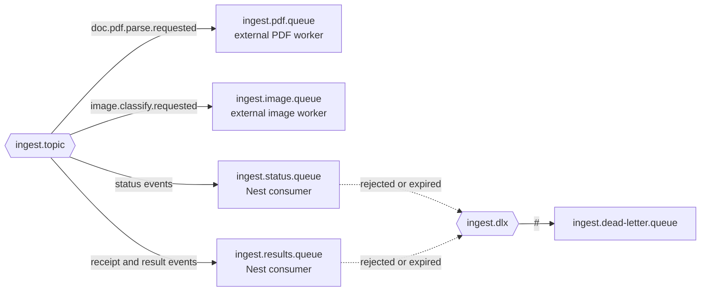

# Architecture

## Overview

This repository is a NestJS monolith for receipt ingestion and read-only
personal spending analysis. It has three entry points:

- Authenticated HTTP endpoints for uploads, ingestion-job status, and chat.
- A Telegram webhook for receipt-related conversation and notifications.
- RabbitMQ consumers for results produced by external PDF and image workers.

PostgreSQL stores the application data. The same database also backs the
LangGraph Postgres checkpointer and the pgvector document store. The chat agent
does not calculate financial answers from the model's memory: it calls
server-owned receipt analytics tools that scope every query to the authenticated
user.

`main.ts` enables CORS and listens on `PORT` (default `3000`). It does not set a
global route prefix, so the routes documented here are rooted at `/`, not
`/api/v1`.

## Module map

```text
AppModule
├── ConfigModule             environment configuration
├── DatabaseModule           TypeORM PostgreSQL connection
├── AuthModule               Google OAuth and signed Bearer session tokens
├── ChatModule               HTTP chat sessions and retention
├── AgentModule              LangGraph financial agent and checkpointer
├── LlmModule                OpenAI / Anthropic chat-model factory
├── ReceiptModule            receipt persistence, review, and categorization
├── ReceiptAnalyticsModule   deterministic receipt queries and signed cursors
├── IngestionModule          upload jobs and worker-event status updates
├── MessageQueueModule       RabbitMQ publisher, consumer, and event router
├── VectorStoreModule        pgvector document storage
├── WebSearchModule          Tavily search-log persistence
├── TelegramModule           Telegraf webhook integration
└── ScraperModule            periodic scraping of logged web-search URLs
```

`ResponseInterceptor` wraps successful controller values in the standard API
envelope. `GlobalExceptionFilter` maps errors to the same envelope, logs 5xx
errors with their stack, and logs 4xx errors as warnings.

## Configuration and model selection

`ConfigModule` loads [configuration.ts](../src/config/configuration.ts). The
chat-model provider is selected by `LLM_PROVIDER`:

- `openai` creates `ChatOpenAI`.
- Any other value uses `ChatAnthropic`; the default is `anthropic`.

`LLM_MODEL` optionally overrides the provider's default model. The defaults are
`gpt-4o` for OpenAI and `claude-sonnet-4-6` for Anthropic. For example:

```env
LLM_PROVIDER=openai
LLM_MODEL=gpt-5-mini
```

The vector store always uses OpenAI `text-embedding-3-small`, independently of
the selected chat provider. Therefore `OPENAI_API_KEY` is required whenever the
vector store starts.

## Authentication and HTTP boundaries

Google OAuth starts at `GET /auth/google` and returns through
`GET /auth/google/callback`. After validating Google's ID token, `AuthService`
issues an HMAC-SHA256 signed, Bearer-style session token containing the Google
subject and verified email. `GET /auth/me` verifies that token.

`GoogleAuthGuard` protects the chat and ingestion controllers. It requires an
exactly formatted `Authorization: Bearer <token>` header and sets
`request.user`; clients cannot supply a user ID in the body or query string.

The protected application endpoints are:

- `POST /chat/messages` creates a chat session and sends its first message.
- `POST /chat/sessions/:sessionId/messages` continues an owned session.
- `DELETE /chat/sessions/:sessionId` deletes an owned session and its LangGraph
  checkpoint history.
- `POST /ingest/file` accepts a PDF or supported image in the `file` multipart
  field.
- `GET /ingest/jobs/:id` returns an ingestion job only to its owner.

## Chat and financial-agent flow

```text
Authenticated client
  → POST /chat/messages
  → ChatService creates chat_sessions row with a UUID
  → AgentService.invoke(userId, message, sessionId)
      → createReactAgent for this invocation
      → PostgresSaver loads and persists the LangGraph thread
      → model decides whether to call a receipt tool
          ├── get_purchase_summary
          └── search_purchase_items
      → model turns the tool result into the final reply
  → ChatService updates chat_sessions.updated_at
  → API response: { sessionId, reply }
```

For a continuation request, `ChatService` first looks up the session by both
`sessionId` and the authenticated `userId`. A missing or foreign session is
reported as `404`, preventing cross-user thread access.

The `sessionId` is also the LangGraph `thread_id`. LangGraph checkpoint tables,
not the legacy `messages` table, retain conversational message history. Deleting
a session deletes its checkpointer thread before deleting the `chat_sessions`
row.

`ChatSessionRetentionService` runs daily at 03:00 in `Asia/Ho_Chi_Minh`. It
deletes up to 1,000 sessions whose `updated_at` is more than 90 days old, along
with their checkpointer threads.

### Agent behavior

`AgentService` constructs a fresh ReAct agent per call. Each invocation has a
fixed clock value and a maximum of five receipt-tool calls. The agent receives a
financial prompt that requires receipt evidence for claims about purchases,
spending, or categories.

For a question detected as a financial claim, the service checks whether the
current turn produced receipt evidence. If not, it runs one policy-retry agent
invocation with a stricter prompt. If evidence still is unavailable, it returns
a safe unavailable-data response. Failures during financial requests are also
converted to a safe unavailable-data response; non-financial failures propagate
to the HTTP or Telegram error boundary.

The currently registered tools are:

- `get_purchase_summary` calls `ReceiptAnalyticsService.getPurchaseSummary` for
  a relative (`last_week` or `last_month`) or absolute date range. It returns
  deterministic counts, totals by currency, category totals, coverage, and a
  small set of receipt references.
- `search_purchase_items` calls
  `ReceiptAnalyticsService.searchPurchaseItems` with optional item-name,
  merchant, category, date-range, and cursor filters. It defaults to
  `sortBy: totalPrice`; `sortBy: purchasedAt` returns newest purchases first.
  Its opaque HMAC-signed cursor is bound to the user, filters, range, ordering,
  and a one-hour expiry.

The tool callbacks receive the trusted server-side user ID by closure. The model
cannot select another user's data. The Zod tool schemas reject unexpected
arguments, including model-supplied user identifiers.

`knowledge-base.tool.ts` and `web-search.tool.ts` remain in the repository but
are not passed to the current `createReactAgent` call. Consequently the current
financial chat path does not run vector retrieval or Tavily search.

### Telegram

Telegram calls `POST /telegram/webhook`, which passes the update to Telegraf.
For text messages, `TelegramUpdate` calls `AgentService.invoke` using the
Telegram sender ID as both the user identity and default LangGraph thread ID,
then replies through Telegraf. Telegram conversations therefore have checkpoint
memory per Telegram user but do not create a `chat_sessions` row.

## Receipt ingestion and event processing

```text
Authenticated upload
  → POST /ingest/file
  → Multer writes storage/uploads/<uuid>.<extension>
  → IngestionService hashes the file and creates or reuses ingestion_jobs
  → MessageQueueService publishes a persistent event to ingest.topic
      ├── doc.pdf.parse.requested → external PDF worker queue
      └── image.classify.requested → external image worker queue

External worker result
  → ingest.status.queue or ingest.results.queue
  → MessageQueueConsumer validates and routes the envelope
  → registered feature consumer updates the job, persists a receipt,
    sends a Telegram review prompt, or queues categorization
```

Upload deduplication is per user and file checksum. When a duplicate is found,
the newly written upload is removed and the existing job is returned; no new
worker event is published.

The following incoming events have registered application handlers:

- `doc.pdf.parse.completed` and `image.classify.completed` mark the ingestion
  job complete and save extracted text.
- `job.failed` marks the job failed and stores the worker's error message.
- `receipt.parsed` persists a normalized receipt and its line items, marks the
  job complete, and publishes `receipt.items.categorize` for newly created
  receipts.
- `receipt.items.categorize` uses the configured LLM with structured output to
  classify pending or failed receipt items against the v1 taxonomy.
- `payment.detected` and `receipt.needs_review` update job state and send a
  Telegram follow-up or review prompt.

`doc.chunks.embed.requested` and `job.processing.started` are bound to app
queues, but no `MessageRouter` handler is currently registered for either. The
consumer treats them as non-retryable unknown events and dead-letters them. A
`VectorStoreConsumer` class exists, but it is not registered with the router at
present.

## RabbitMQ topology

The application declares durable topic exchange `ingest.topic`. The external
worker queues are `ingest.pdf.queue` and `ingest.image.queue`; the Nest
application consumes `ingest.status.queue` and `ingest.results.queue`.



Messages are JSON event envelopes containing a schema version, event ID,
correlation ID, event type, attempt number, creation timestamp, and payload.
Payloads are validated by the router before dispatch. Invalid or unknown events
are rejected without requeueing and are dead-lettered. Other handler failures
are nacked with requeueing.

The worker queues do not receive a dead-letter-exchange argument from this
application. The status and results queues do.

## Vector store, web search, and scraper

`VectorStoreService` initializes `PGVectorStore` using the
`document_embeddings` table and OpenAI `text-embedding-3-small`. It exposes
document insertion, similarity search, and a retriever factory.

`WebSearchService` can call Tavily, persist result URLs in `web_search_logs`,
and format search results. `ScraperService` runs every six hours; it fetches
unscraped logged URLs, strips non-content HTML, embeds up to 8,000 characters,
and marks successful URLs as scraped. Failed URLs remain eligible for a later
attempt. These services are operationally available but are not currently
called by the registered financial-agent tools.

## Persistence

The authoritative PostgreSQL table inventory and relationship diagram are in
[Database schema](database-schema.md). In addition to those TypeORM-managed
tables, LangGraph creates and manages its checkpoint tables, while PGVector
maintains `document_embeddings`.

The legacy `messages` table is retained from the initial migration but has no
current TypeORM entity and is not used for chat memory.

## Design constraints

- Receipt analytics are deterministic relational queries; the LLM selects and
  summarizes tools but is not trusted to invent personal financial data.
- HTTP chat ownership is enforced at the session lookup and analytics queries
  are scoped by authenticated user ID.
- A fresh agent is created for every invocation so prompt, tool closures, clock,
  and budget are per request, while LangGraph persistence still supplies the
  thread history.
- Receipt categorization uses structured LLM output and records a status,
  confidence, taxonomy version, and metadata per line item.
- Ingestion is asynchronous across RabbitMQ. The Nest application publishes
  upload work and consumes the result events that it owns; parsing workers are
  external to this repository.
