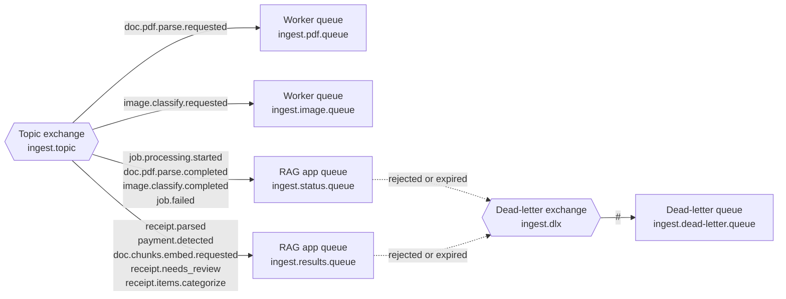

# Architecture

## Overview

The application is a NestJS monolith composed of loosely coupled modules. All AI logic runs through LangChain/LangGraph; PostgreSQL with pgvector handles both relational data and vector embeddings.

The product is centered on **receipt intelligence**: users can upload or forward receipts, the system extracts merchants, totals, taxes, and line items, and the chatbot helps analyze spending over time. Manual expense entry is treated as a fallback, not the primary workflow.

---

## Module Map

```
AppModule
├── ConfigModule          — environment variables
├── DatabaseModule        — TypeORM + PostgreSQL
├── LlmModule             — Claude / GPT-4o abstraction
├── VectorStoreModule     — PGVector read/write
├── WebSearchModule       — Tavily API + search log
├── IngestionModule       — receipt / document ingestion and parsing
├── ReceiptModule         — receipt entities, itemized spend analytics, summaries
├── AgentModule           — LangGraph ReAct agent
├── TelegramModule        — Telegraf bot + webhook
└── ScraperModule         — background cron scraper
```

---

## Data Flows

### 1. Chat and spending analysis (Telegram → Agent → LLM)

```
User message (Telegram)
  → POST /telegram/webhook
  → TelegramUpdate (bot.on('text'))
  → AgentService.invoke(userId, message)
      → createReactAgent per-invocation
            llm: LlmService.getModel()
            tools: [search_knowledge_base, search_receipts, search_web(userId)]
            (web search tool is created per-invoke to capture userId)
      → LangGraph ReAct decides which tools to call
          ├── search_knowledge_base({ query })
          │     → VectorStoreService.similaritySearch(query, k=4)
          │     → returns top-4 chunks formatted as "Source: <url>\n<text>"
          │     → "No relevant information found." if empty
          ├── search_receipts({ query, dateRange? })
          │     → ReceiptService/AnalyticsService queries itemized expense data
          │     → returns summaries such as total spend, category breakdowns, merchant history, and trends
          └── search_web({ query })
                → WebSearchService.search(query, userId)
                → POST https://api.tavily.com/search (max_results: 3)
                → saves each result URL to web_search_logs (scraped: false)
                → returns formatted results prefixed with ⚠️ web search notice
      → LLM synthesizes context into final answer or advice
  → ctx.reply(answer)
```

### 2. Receipt and document ingestion

```
POST /ingest/file (multipart/form-data, field: "file")
  → FileInterceptor (multer diskStorage → storage/uploads/<timestamp>-<name>)
  → IngestionService.createJobFromUpload(file)
      → detect source type from MIME type + extension
      → create `ingestion_jobs` row with status=pending
      → persist metadata about the original filename, storage path, MIME type, and source type
      → build a dispatch envelope with shared generic event fields
  → CommonDispatchService.dispatch(eventType, payload)
      → returns a standardized event envelope for later RabbitMQ publishing
  → a future RabbitMQ publisher will send the envelope to the broker
  → job processor decides whether the file is a receipt, invoice, or generic document
      → receipt path: OCR / text extraction → merchant, date, totals, taxes, currency, line items
      → document path: chunk text → embeddings for knowledge-base search
      → normalize extracted receipt data into relational tables for analytics
  → { message: "File uploaded and detected", job: { id, status }, event: { ... } }
```

### 3. Background Web Scraper (every 6 hours)

```
Cron: 0 */6 * * *  (ScraperService.scrapeAndEmbed)
  → WebSearchService.getUnscraped()
        → SELECT * FROM web_search_logs WHERE scraped = false
  → for each log:
      → axios.get(log.url, timeout: 10s)
      → cheerio: remove script/style/nav/footer, extract body text
      → normalize whitespace
      → if content.length > 100:
            → VectorStoreService.addDocuments([Document])
                  pageContent: content.slice(0, 8000)
                  metadata: { source: log.url, type: 'web' }
      → WebSearchService.markScraped(log.id)
            → UPDATE web_search_logs SET scraped = true WHERE id = ?
      → failed URLs are warned and skipped (no retry)
```

---

## RabbitMQ topology

The broker declares the durable `ingest.topic` topic exchange and routes events
to the queues shown below. The RAG application queues dead-letter rejected or
expired messages to `ingest.dlx`; worker queues do not currently have a
dead-letter exchange configured.



| Queue | Consumers | Binding keys |
|---|---|---|
| `ingest.pdf.queue` | PDF worker | `doc.pdf.parse.requested` |
| `ingest.image.queue` | Image worker | `image.classify.requested` |
| `ingest.status.queue` | RAG app | `job.processing.started`, `doc.pdf.parse.completed`, `image.classify.completed`, `job.failed` |
| `ingest.results.queue` | RAG app | `receipt.parsed`, `payment.detected`, `doc.chunks.embed.requested`, `receipt.needs_review`, `receipt.items.categorize` |
| `ingest.dead-letter.queue` | Operations / recovery workflow | All events published to `ingest.dlx` (`#`) |

Source: [`message-queue.constants.ts`](../src/message-queue/message-queue.constants.ts) and [`broker.service.ts`](../src/message-queue/broker/broker.service.ts).

---

## Database Schema

The canonical PostgreSQL table inventory and entity-relationship diagram are
maintained in [Database schema](database-schema.md). PGVector also creates and
maintains its own embedding storage independently of the TypeORM migrations.

---

## LLM Provider Abstraction

`LlmService.getModel()` reads `LLM_PROVIDER` and returns a LangChain `BaseChatModel`.

Embeddings always use OpenAI `text-embedding-3-small` regardless of the LLM provider, so `OPENAI_API_KEY` is always required.

## Database Migrations

TypeORM migrations are managed from `src/database/data-source.ts`, which points to `src/database/migrations/*.ts`.

Recommended commands:

```bash
npm run migration:generate -- --name MigrationName
npm run migration:run
npm run migration:revert
```

---

## Agent Tool Definitions

### `search_knowledge_base`

- Description: "Search uploaded PDF documents for relevant information. Use this first before searching the web."
- Input schema: `{ query: string }`
- Returns: top-4 similar chunks joined as `Source: <url>\n<text>`, or a "not found" message
- Source: [src/agent/tools/knowledge-base.tool.ts](../src/agent/tools/knowledge-base.tool.ts)

### `search_web`

- Description: "Search the internet for up-to-date information. Only use this if the knowledge base has no relevant results."
- Input schema: `{ query: string }`
- Returns: Tavily results formatted as numbered list with URL + snippet, prefixed with a web-search notice
- Side effect: logs each result URL to `web_search_logs` for later scraping
- Created per-invocation to capture the calling `userId`
- Source: [src/agent/tools/web-search.tool.ts](../src/agent/tools/web-search.tool.ts)

---

## Key Design Decisions

- **Agent per invocation** — `AgentService.invoke` creates a fresh `createReactAgent` on every call rather than reusing one. This is intentional: the web search tool must close over the current `userId` to correctly attribute search logs.
- **Repository pattern for persistence** — persistence lives behind repository classes in `src/repositories/`, while feature services handle orchestration. This keeps TypeORM and storage concerns out of controllers and keeps domain logic easier to test.
- **Generic base repository pattern** — shared CRUD behavior should live in `BaseRepository<T>` and shared contracts should live in `BaseRepositoryInterface<T>`. Feature repositories should extend the base repository and only add domain-specific persistence methods.
- **Receipt data is the source of truth for analytics** — itemized receipts are normalized into relational tables so the chatbot can answer spending questions reliably without re-reading raw receipt text every time.
- **Scraper enriches the knowledge base over time** — web search results are immediately returned to the user as raw Tavily snippets, but the full page content is scraped asynchronously and added to the vector store, improving future knowledge base hits for similar queries.
- **No conversation memory in the agent** — messages are stored in the `messages` table but the agent currently does not load prior messages as context. Each invocation is stateless from the LLM's perspective.
- **Future shopping advice is layered on top of analytics** — once spending history is captured, the assistant can compare frequently purchased items against online prices from a curated set of stores and suggest cheaper options.
- **Receipt-first finance tracking is a better fit than manual expense entry** — for this use case, the primary workflow should be receipt ingestion and line-item extraction, not asking the user to type each purchase manually. The system should parse receipts, store itemized expenses, and support analytics over weeks or months.
- **Future shopping advice can be layered on top** — once itemized spending is stored, the agent can compare recurring purchases against online store prices and suggest cheaper alternatives from a curated list of stores when web search is enabled.
