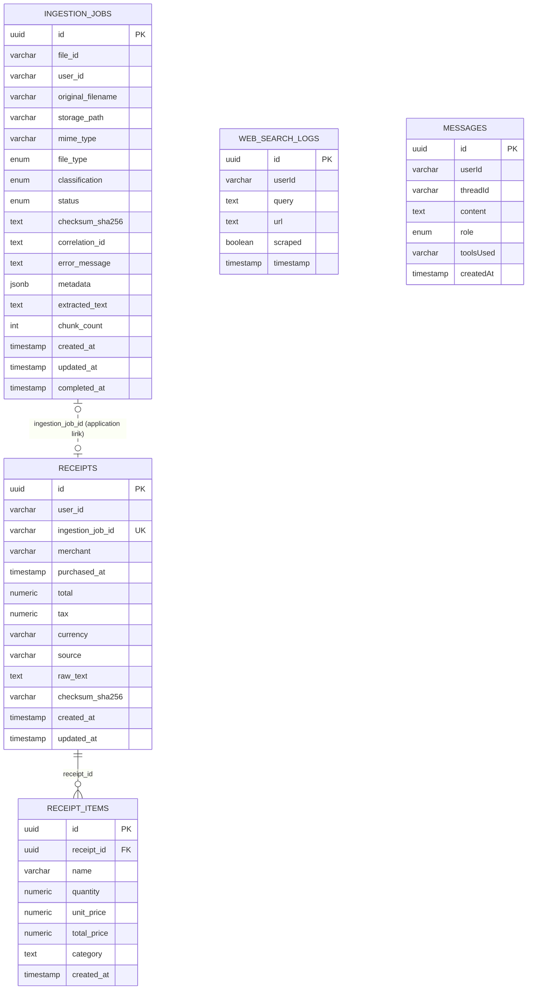

# Database schema

The schema below reflects the current TypeORM entities and database migrations.

## Relationships and constraints

- `receipt_items.receipt_id` has a database foreign key to `receipts.id`.
- `receipts.ingestion_job_id` is nullable and has a partial unique index, allowing at most one receipt for an ingestion job.
- `receipts.ingestion_job_id` does **not** have a database foreign key to `ingestion_jobs.id`; the service maintains this relationship.
- Receipts are additionally unique on `user_id`, `merchant`, `purchased_at`, `total`, and `checksum_sha256`.
- `web_search_logs` and `messages` have no declared relationships. `messages` is created by the initial migration but has no current TypeORM entity.
