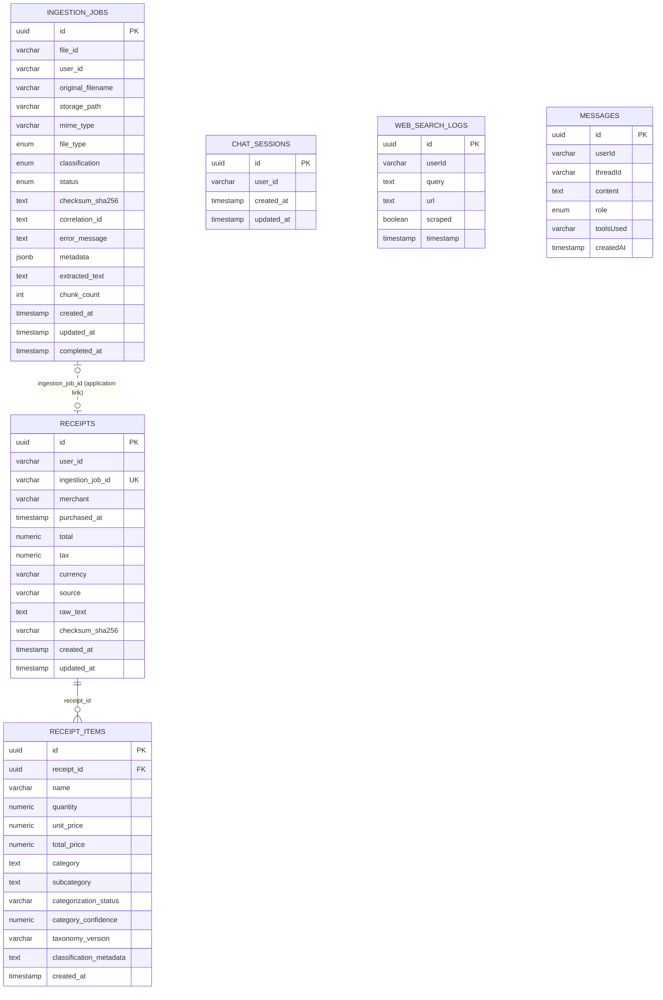

# Database schema

The schema below reflects the current TypeORM entities and database migrations.

## Table inventory

| Table | Purpose | Primary key | Database relationship |
|---|---|---|---|
| `ingestion_jobs` | Tracks uploaded PDF and image processing jobs. | `id` | Application-linked, one-to-zero-or-one `receipts` row through `receipts.ingestion_job_id`. |
| `receipts` | Normalized receipt header and financial totals. | `id` | One-to-many `receipt_items`; optionally linked to one ingestion job. |
| `receipt_items` | Parsed line items and their categorization result. | `id` | Many-to-one `receipts` through `receipt_id`. |
| `chat_sessions` | Durable session ownership and lifecycle metadata. | `id` | No declared foreign keys. Its ID is also used as the LangGraph thread identifier. |
| `web_search_logs` | Tavily search results awaiting or completing scraping. | `id` | No declared foreign keys. |
| `messages` | Legacy persisted messages from the initial schema. | `id` | No declared foreign keys or current TypeORM entity. |

## Relationships and constraints

- `receipt_items.receipt_id` has a database foreign key to `receipts.id`.
- `receipts.ingestion_job_id` is nullable and has a partial unique index, allowing at most one receipt for an ingestion job.
- `receipts.ingestion_job_id` does **not** have a database foreign key to `ingestion_jobs.id`; the service maintains this relationship.
- Receipts are additionally unique on `user_id`, `merchant`, `purchased_at`, `total`, and `checksum_sha256`.
- `ingestion_jobs` has a partial unique index on `(user_id, checksum_sha256)` when `checksum_sha256` is present, preventing duplicate uploads by the same user.
- `chat_sessions` has an index on `user_id` for ownership and retention queries.
- `web_search_logs`, `chat_sessions`, and `messages` have no declared foreign-key relationships. `messages` is created by the initial migration but has no current TypeORM entity.
