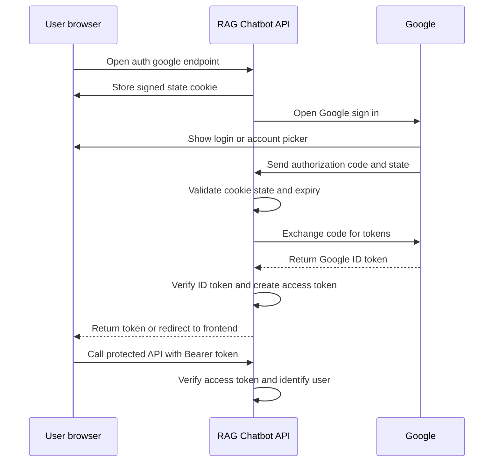

# Google SSO

This service uses Google OAuth 2.0 / OpenID Connect for browser sign-in. Google
authenticates the user, and the API verifies the Google ID token before issuing
its own signed Bearer access token.

## Prerequisites

1. In [Google Cloud Console](https://console.cloud.google.com/), create or select
   a project.
2. Configure the OAuth consent screen.
3. Create an **OAuth client ID** of type **Web application**.
4. Add the exact callback URL as an authorized redirect URI. For local development:

   ```
   http://localhost:3000/auth/google/callback
   ```

5. Copy the client ID and client secret into `.env`.

## Configuration

```env
GOOGLE_CLIENT_ID=your-google-oauth-client-id
GOOGLE_CLIENT_SECRET=your-google-oauth-client-secret
GOOGLE_CALLBACK_URL=http://localhost:3000/auth/google/callback
AUTH_JWT_SECRET=replace-with-a-long-random-secret
AUTH_JWT_EXPIRES_IN_SECONDS=86400

# Optional. When set, successful login redirects here with token data in the
# URL fragment rather than returning the token as JSON.
# AUTH_SUCCESS_REDIRECT_URL=http://localhost:5173/auth/callback
```

Generate `AUTH_JWT_SECRET` with a high-entropy value, for example:

```bash
openssl rand -base64 48
```

Keep `GOOGLE_CLIENT_SECRET` and `AUTH_JWT_SECRET` out of source control.

## Sign-in flow



The state cookie binds the Google callback to the browser that initiated login,
which protects against OAuth login-CSRF. The API only accepts a Google account
with a verified email address.

## Endpoints

### Start Google login

```
GET /auth/google
```

Open this endpoint in a browser. It sets the short-lived OAuth state cookie and
redirects the user to Google.

### Handle the Google callback

```
GET /auth/google/callback
```

Google calls this endpoint after successful login. When
`AUTH_SUCCESS_REDIRECT_URL` is not configured, the response contains:

```json
{
  "status": "success",
  "message": "Success",
  "data": {
    "accessToken": "<signed-token>",
    "tokenType": "Bearer",
    "expiresIn": 86400,
    "user": {
      "id": "google-subject-id",
      "email": "user@example.com",
      "name": "Example User",
      "picture": "https://..."
    }
  }
}
```

When `AUTH_SUCCESS_REDIRECT_URL` is configured, the API redirects to that URL
and puts `access_token`, `token_type`, and `expires_in` in its URL fragment.
Fragments are not sent in HTTP requests, which avoids exposing the token to the
redirect destination's server logs.

### Retrieve the current user

```
GET /auth/me
Authorization: Bearer <access-token>
```

## Calling protected APIs

All chat and ingestion routes require the application access token:

```http
POST /chat/messages
Authorization: Bearer <access-token>
Content-Type: application/json

{ "message": "Summarize my documents" }
```

```http
POST /ingest/file
Authorization: Bearer <access-token>
Content-Type: multipart/form-data
```

The API uses the stable Google `sub` claim as its internal user ID. It does not
read `x-user-id`; callers cannot select a different user's identity. Ingestion
job lookup also checks that the authenticated user owns the requested job.

## Production checklist

- Register the production callback URL exactly in Google Cloud Console.
- Use HTTPS for the API and `AUTH_SUCCESS_REDIRECT_URL`.
- Generate a unique, long `AUTH_JWT_SECRET` for each environment.
- Set an appropriate token lifetime with `AUTH_JWT_EXPIRES_IN_SECONDS`.
- Do not log authorization codes, Google tokens, application access tokens, or
  client secrets.
