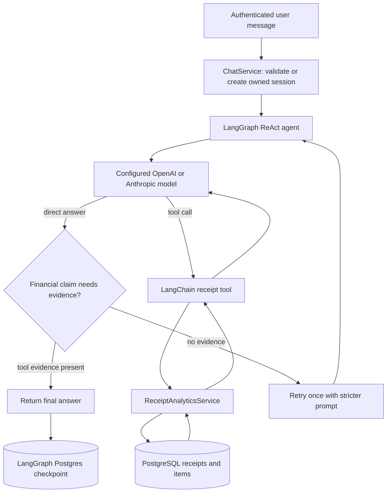

# Receipt Financial Agent

This guide describes the implemented receipt-focused chat agent. It is the
technical companion to [the product requirements document](prd-receipt-financial-agent.md).

The agent answers questions from parsed receipts owned by the authenticated
Google user. It uses an LLM to decide which predefined function to call and to
explain deterministic results. It does not let the LLM generate SQL, choose a
user ID, access raw OCR text, or perform direct writes.

## Scope

Implemented read capabilities:

- deterministic purchase summaries;
- paginated receipt-item search;
- `last_week`, `last_month`, `last_quarter`, and explicit date ranges;
- persistent, user-owned chat sessions;
- HMAC-signed keyset cursors;
- asynchronous receipt-item categorization;
- guardrails for evidence, tool-call limits, and safe failures.

The next planned capability is confirmed write actions for spending preferences
and category corrections. Those write tools are intentionally not exposed yet.

## LangChain and LangGraph

LangChain supplies the building blocks:

- `ChatOpenAI` or `ChatAnthropic` through `LlmService`;
- LangChain `tool(...)` definitions;
- Zod schemas for tool arguments;
- message classes such as `HumanMessage`, `AIMessage`, and `ToolMessage`.

LangGraph orchestrates the stateful agent loop:

- a model decides whether to answer or call a tool;
- a tool result returns to the model for a natural-language explanation;
- the graph can loop through multiple tool calls;
- a Postgres checkpointer persists message history under a chat session ID;
- a post-model hook stops a sixth receipt-tool request before it executes.



`AgentService` creates the agent for every request. That is intentional: each
tool closure captures the current authenticated user ID and request-scoped
tool-call budget.

## Agent setup

`src/agent/agent.service.ts` creates the LangGraph ReAct agent with only these
tools:

| Tool | Purpose |
| --- | --- |
| `get_purchase_summary` | Counts, totals by currency, category coverage, and receipt references. |
| `search_purchase_items` | Filtered receipt items with stable cursor pagination. |

Knowledge-base search and web search are not registered on this financial
agent. Their code may still exist elsewhere in the application, but the model
cannot call them through the receipt chat flow.

Each agent receives a trusted dynamic prompt containing the current
application time, `Asia/Ho_Chi_Minh`, read-only policy, evidence requirement,
and tool budget. User messages and tool results are not interpolated into this
system prompt.

### Evidence policy

Questions that appear to ask about the user's purchases, receipts, spending,
or categories require an approved receipt tool call in the current turn.

1. The agent runs normally.
2. If a personal financial question receives a direct answer without a receipt
   tool call, the service retries once with a stronger trusted instruction.
3. If the retry also lacks evidence, the service returns a fixed inability
   response instead of the model's estimate.
4. Unexpected receipt-access failures also return a non-sensitive inability
   response for financial questions.

Evidence is checked only after the most recent human message. A tool result
from an earlier turn cannot validate a new financial claim.

### Tool-call budget

One user message can execute at most five receipt tool calls. The limit is
enforced twice:

- `ToolCallBudget` protects the database boundary if a tool is invoked too
  often;
- `enforceToolCallBudget` is a LangGraph post-model hook that replaces a sixth
  requested tool call with a final request to narrow the question.

## Tool contracts

Tool schemas use Zod. Zod validates runtime JSON from the LLM, which TypeScript
types alone cannot do. Both schemas use `.strict()`, so unsupported arguments
such as `userId`, arbitrary SQL, or unknown filters are rejected.

The authenticated `userId` is a function parameter captured by backend code;
it is absent from every model-visible schema.

### `get_purchase_summary`

The summary tool returns structured JSON with:

- resolved UTC boundaries and application timezone;
- receipt count, line-item count, and purchased-unit count;
- totals grouped by currency, without currency conversion;
- category totals from completed categorization only;
- categorization coverage and receipt merchant/date references.

Missing quantities count as one purchased unit. Empty matching periods return
`NO_DATA`. A summary with pending or failed categories remains successful, but
includes `CATEGORIZATION_INCOMPLETE` so the model can disclose the gap.

### `search_purchase_items`

The item-search tool accepts:

- relative or absolute date range;
- optional item-name, merchant, and category filters;
- page size from 1 to 50, defaulting to 20;
- an optional opaque continuation cursor.

It returns stable item and receipt references, item quantities/prices, merchant,
purchase time, category, and currency. It never returns `receipts.raw_text`.

## Date ranges

All version-1 report boundaries use `Asia/Ho_Chi_Minh`.

| Input | Meaning |
| --- | --- |
| `last_week` | Previous Monday 00:00 through current Monday 00:00. |
| `last_month` | Previous complete calendar month, from day 1 at 00:00 through the next month’s day 1 at 00:00. |
| `last_quarter` | Previous complete calendar quarter, from its first day at 00:00 through the current quarter’s first day at 00:00. |
| `absolute` | Half-open `[startDate, endDate)` local-date range. |

The resolver converts local boundaries to UTC before querying PostgreSQL. An
absolute range cannot exceed 366 days.

## Item-search pagination

Pagination uses keyset pagination, not `OFFSET` and not a connection-bound
PostgreSQL cursor.

Items are sorted by:

```text
total_price DESC, item_id DESC
```

The second key makes equal-priced items deterministic. The service fetches one
extra item to learn whether a next page exists, then signs the final returned
item's sort position into `nextCursor`.

### Cursor contents and security

The cursor uses this shape:

```text
Base64URL(payload).Base64URL(HMAC-SHA256 signature)
```

Its signed payload includes:

- protocol version;
- an HMAC-derived user binding, not the raw user ID;
- hash of the normalized filters;
- resolved date-range boundaries;
- snapshot (`asOf`) timestamp;
- last item's total and ID;
- expiry timestamp.

The cursor contains no item name, merchant name, raw OCR text, or raw user ID.
The server rejects altered, expired, wrong-user, wrong-filter, and wrong-range
cursors with structured cursor errors.

The first page chooses `asOf = now`. Later pages reuse the signed `asOf` and
query `item.created_at <= asOf`, so items added after page one do not appear in
the ongoing page sequence.

Set a dedicated secret before deploying:

```dotenv
RECEIPT_CURSOR_HMAC_SECRET=replace-with-a-different-long-random-secret
```

It must not reuse `AUTH_JWT_SECRET`.

## Session ownership and history

`ChatSession` records own a UUID session ID and authenticated user ID. A new
session is saved before its first agent invocation, and that exact ID becomes
the LangGraph `thread_id`.

- Continuing or deleting a session verifies the user owns it.
- LangGraph history uses `PostgresSaver` through `AgentCheckpointerService`.
- Old sessions are removed after 90 days by a scheduled cleanup service.
- `DELETE /chat/sessions/:sessionId` removes both checkpoints and session row.

Application-level encryption of checkpoint content is still out of scope, so
tool output should remain concise and free of raw OCR text.

## Receipt categorization

Receipt parsing stores factual receipt fields and item lines first. New items
begin with `categorizationStatus = pending`; a source/OCR category suggestion,
if present, is stored only in diagnostic metadata.

After the receipt transaction commits, `ReceiptService` publishes
`receipt.items.categorize`. The categorization consumer invokes
`ReceiptCategorizationService`, which:

1. loads only pending or failed items belonging to the event user;
2. asks the configured model for structured category, subcategory, and
   confidence output;
3. validates the result against taxonomy version `v1`;
4. persists `completed` output, or `unknown` when confidence is below `0.70`;
5. records `failed` and rethrows on model/validation failure so the existing
   RabbitMQ consumer can retry it.

Only completed, non-`unknown` categories contribute to category totals and
coverage. This prevents provisional labels from being reported as facts.

## Error handling

Expected user-correctable tool errors are structured:

| Code | Meaning |
| --- | --- |
| `NO_DATA` | No receipt matches the requested period. |
| `INVALID_DATE_RANGE` | Date format, order, or duration is invalid. |
| `CURSOR_INVALID` | Cursor is altered or does not match the request/user. |
| `CURSOR_EXPIRED` | Cursor is too old to continue safely. |
| `TOOL_CALL_LIMIT_EXCEEDED` | Tool boundary rejected an excessive call. |
| `CATEGORIZATION_INCOMPLETE` | Category totals exclude pending/failed/unknown items. |

Unexpected infrastructure errors are not returned to the model as database
details. Financial questions fail closed with a safe message.

## Verification

The financial-agent tests use fake chat models and SQLite-backed integration
tests; they do not make real OpenAI or Anthropic calls. Important coverage
includes ownership, session lifecycle, date boundaries, user isolation,
quantities, currency grouping, signed cursor checks, keyset traversal,
tool-schema validation, retry/fail-closed behavior, five-call budget,
categorization confidence, and queue-consumer retry behavior.

Run locally:

```bash
npm run lint
npm run build
npm test -- --runInBand
```
