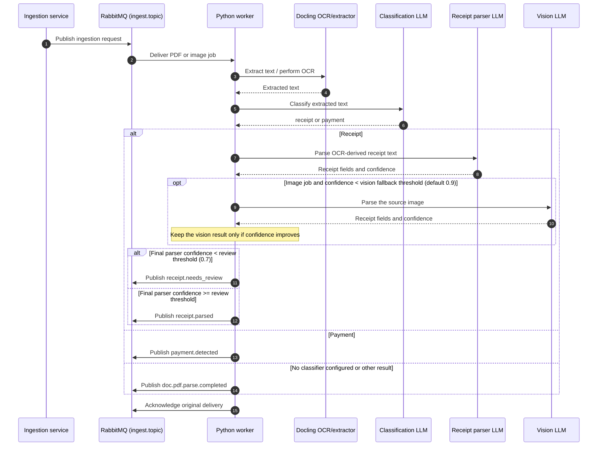

# Python Worker

File processing worker for receipt intelligence. Consumes ingestion jobs from RabbitMQ, extracts layout-aware text from PDFs and images with Docling, classifies receipts and payments, parses receipts, and publishes results back to the event bus.

## Prerequisites

- Python 3.11–3.13
- [Poetry](https://python-poetry.org/) for dependency management

## Setup

```bash
poetry install
```

## Run

```bash
poetry run python main.py
```

### Environment variables

| Variable | Default | Description |
|---|---|---|
| `RABBITMQ_URL` | `amqp://localhost` | RabbitMQ connection URL |
| `RABBITMQ_EXCHANGE` | `ingest.topic` | Topic exchange name |
| `RABBITMQ_PDF_QUEUE` | `ingest.pdf.queue` | Queue for PDF parse requests |
| `RABBITMQ_IMAGE_QUEUE` | `ingest.image.queue` | Queue for image classify requests |
| `RABBITMQ_PREFETCH_COUNT` | `10` | Max unacked messages per worker |
| `DOCLING_ARTIFACTS_PATH` | — | Optional path to pre-fetched Docling layout/table/RapidOCR models |
| `ANTHROPIC_API_KEY` | — | Anthropic API key for LLM classification and parsing (optional; skips LLM services if unset) |
| `VISION_FALLBACK_CONFIDENCE_THRESHOLD` | `0.9` | Sends an image to the vision model only when text-only receipt parsing confidence is below this value; set to `0` to disable vision fallback. |

## Tests

```bash
poetry run pytest -v
```

## Debug receipt classification

Use the receipt debugger to inspect the source image, Docling Markdown, exact
classifier prompt/response, and OCR-versus-vision receipt parsing:

```bash
poetry run jupyter lab notebooks/debug_receipt_classification.ipynb
```

By default it opens `/Users/thomas/Downloads/receipts/P0 (2).jpg`. Set
`RECEIPT_DEBUG_IMAGE` before starting Jupyter to inspect another local image.
The classification and parsing cells require `ANTHROPIC_API_KEY` and make LLM
requests.

## Project structure

```
python-worker/
├── main.py                        # Worker entry point (RabbitMQ connection, pipeline wiring)
├── src/
│   ├── consumer/
│   │   └── event_consumer.py      # RabbitMQ decode, publish, failure, and ack handling
│   ├── extractors/
│   │   └── docling_extractor.py   # PDF/image extraction via Docling
│   ├── processing/
│   │   └── ingestion_job_processor.py # Validate and process one ingestion job
│   ├── publisher/
│   │   └── event_publisher.py     # RabbitMQ event publisher
│   └── services/
│       ├── classification_service.py  # LLM-based receipt/payment classification
│       ├── receipt_parser.py          # LLM-based receipt parsing
├── tests/
│   ├── test_docling_extractor.py
│   ├── test_event_consumer.py
│   ├── test_ingestion_job_processor.py
│   ├── test_classification_service.py
│   └── test_receipt_parser.py
├── pyproject.toml                 # Poetry config
├── poetry.lock                    # Locked dependencies
└── Dockerfile                     # Production container
```

## Processing flow

### Sequence diagram



1. Worker listens on `ingest.pdf.queue` and `ingest.image.queue`
2. Consumer validates the message payload as an ingestion job
3. Processor converts HEIC/HEIF to a temporary JPEG when needed
4. Docling extracts native PDF text or performs OCR while preserving layout and tables
5. Processor classifies the text and parses a Receipt or routes a Payment
6. Consumer publishes the resulting event and acknowledges the RabbitMQ delivery

Docling uses its bundled RapidOCR Torch backend with the Vietnamese `vi` recognizer, so no system OCR package is required. It downloads document-layout, table, and OCR models on first conversion. For an offline deployment, pre-fetch them and set `DOCLING_ARTIFACTS_PATH`:

```bash
poetry run docling-tools models download --output-dir ./docling-models \
  layout tableformer rapidocr --rapidocr-backend-lang torch:vi
DOCLING_ARTIFACTS_PATH="$PWD/docling-models" poetry run python main.py
```
